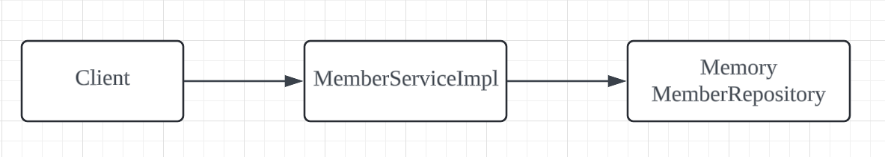
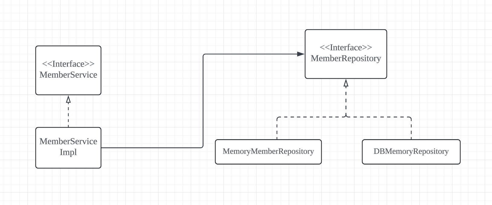
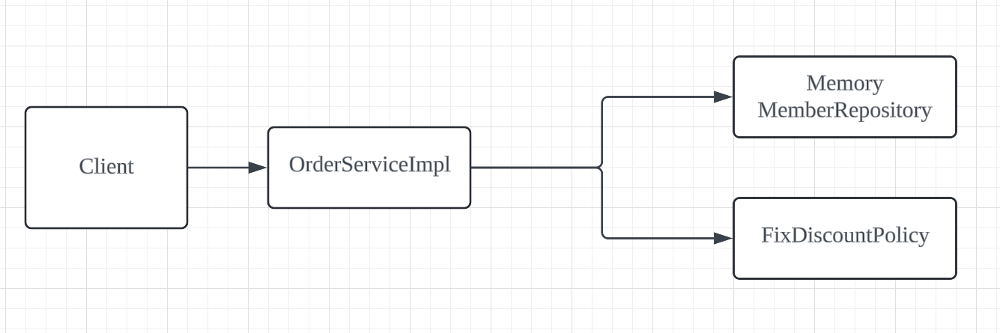

>[김영한님의 스프링 로드맵](https://www.inflearn.com/roadmaps/373)을 수강하며 공부한 내용을 개인적으로 정리한 글입니다.

- **핵심 키워드**
: `도메인 협력 관계`, `클래스 다이어그램`, `객체 다이어그램`

# Section2. 스프링 핵심 원리 이해1 - 예제 만들기

## [비즈니스 요구사항 분석]
- ### 회원 도메인
  - 회원을 가입하고 조회할 수 있다.
  - 회원 등급이 있다.
  - 회원 데이터를 저장할 DB는 미확정
- ### 주문 도메인
  - 회원은 상품을 주문할 수 있다.
  - 회원 등급에 따른 할인 정책이 적용됨
  - 할인 정책은 미확정
## [회원 도메인 설계 및 다이어그램]
- 회원 클래스 다이어그램 

- 회원 객체 다이어그램
  
- MemberRepositoryImpl
```java
public class MemberServiceImpl implements MemberService {
	private final MemberRepository = new MemoryMemberRepository();
    
    ..biz logic..
```

## [주문 도메인 설계 및 다이어그램]
- 주문 클래스 다이어그램

- 주문 객체 다이어그램

- OrderServiceImpl
```java
public class OrderServiceImpl implements OrderService {
	private final MemberRepository = new MemoryMemberRepository();
    private final DiscountPolicy discountPolicy = new FixDiscountPolicy();
    
    ...biz logic...
```

## [설계의 문제점과 해결 방안]

- 변경과 확장 가능성이 있는 모듈은 인터페이스를 만들고 언제든지 갈아끼울 수 있도록 설계해야한다.  
- **good )** 다형성도 활용하고 인터페이스와 구현객체를 분리했지만  
  **bad )** 현재 코드는 인터페이스 뿐 아니라 구체 클래스에도 의존하고 있다.(DIP 위배)  
  또한, 구체 클래스를 변경하게 되면(ex. fixDiscount->rateDiscount) OCP도 위반하게 된다.  
  
- `Section3. 스프링 핵심 원리 이해2 - 객체 지향 원리 적용` 을 통해 더 개선된 형태로 리팩토링을 한다.  
  **keyword** : `관심사의 분리`,`AppConfig`
